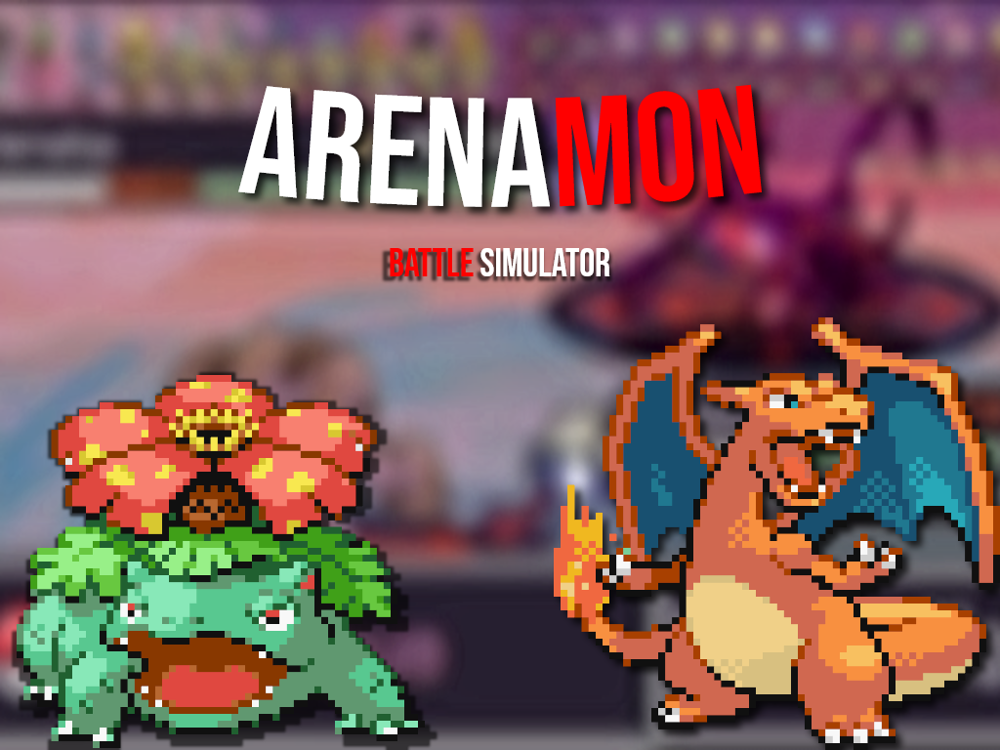
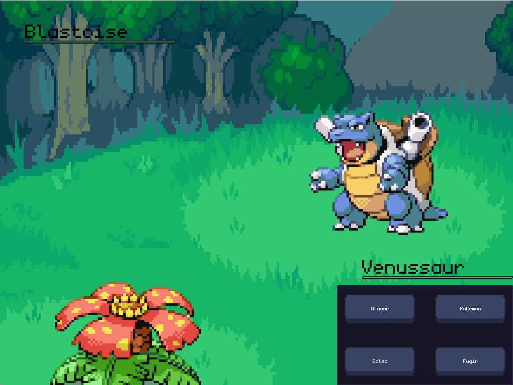
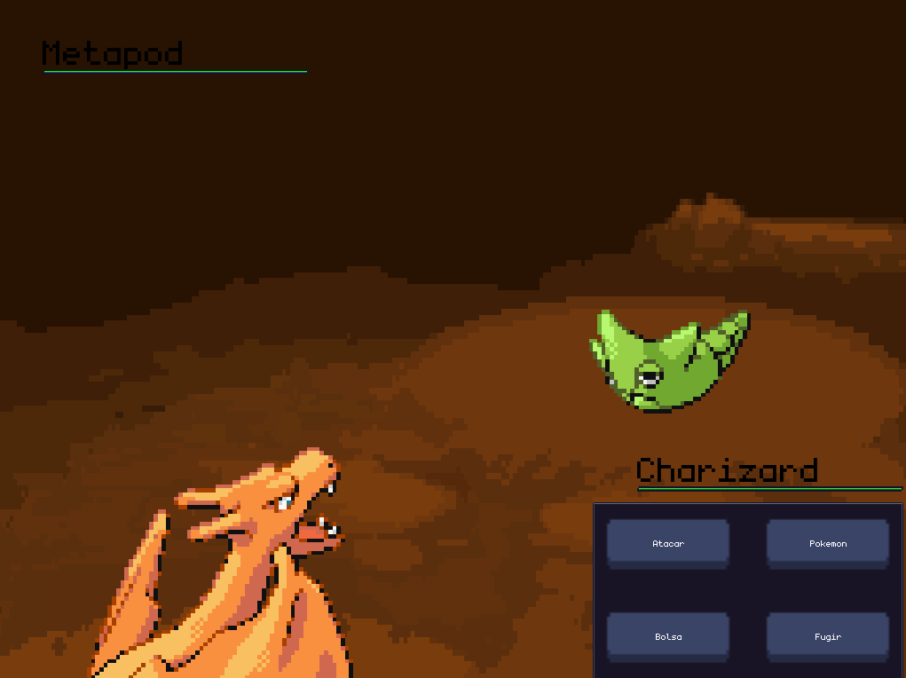
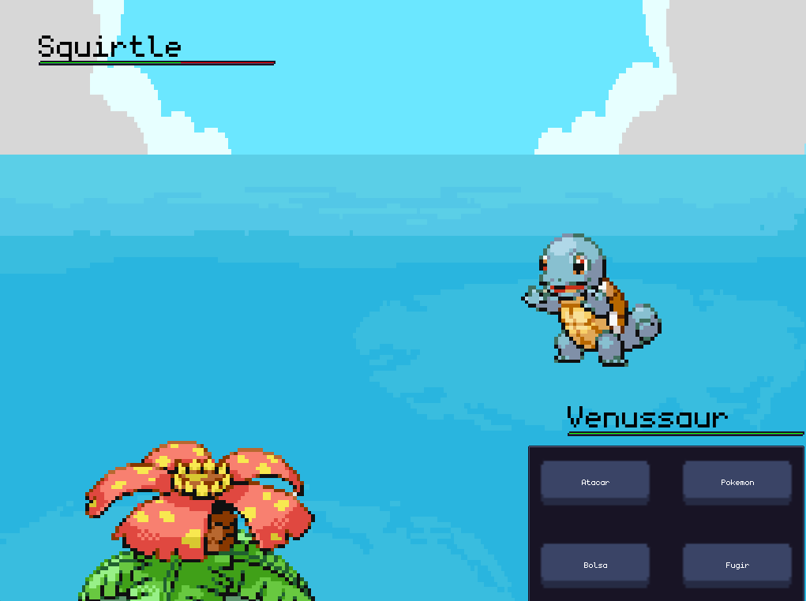
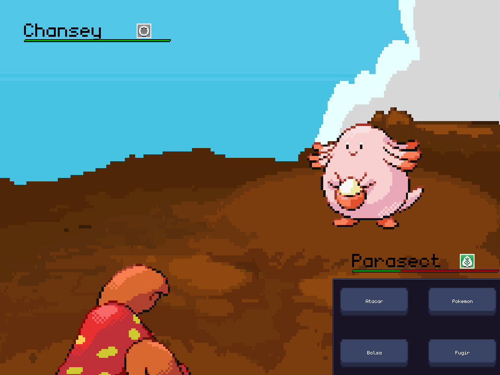

# ArenaMon 🐲

Este é um simulador de batalhas pokemon simples, para colocar em prática alguns dos conceitos principais da programação orientada a objetos assim como o funcionamento de diferentes tecnlogias do ambiente java. 

# Sumário

1. [Screenshots](#screenshots-)
2. [Dependencias](#dependencies-)
3. [Running the Game](#running-the-game-)
4. [Documentation](#documentation-)
    - [Techs](#Techs-)
    - [Folders](#Pastas-)
    - [Classes and Packages](##Classes-e-Packages-)
    - [Stages](#Stages)
5. [Credits](#credits-)

# Screenshots 📷

# Dependencies ⚙️

LibGDX: https://libgdx.com
- Box2D

Java: https://www.java.com

SQLite: https://www.sqlite.org

# Running the game 🚀

    .\gradlew.bat run

Ou execute o arquivo 

    run.bat

# Documentation 📰

## Techs
**LibGdx** - Framework para java usado para desenvolvimento de jogos

**Java** - Linguagem de Programação

**Gradlew** - Ferramente de build que permite acesso ao Gradlew Wrapper (execução da aplicação)

## Pastas 

   - [**assets**](assets): Contém os assets do jogo, como imagens, sons e mapas.
   - [**core**](core/src/main/java/io/github/PokemonGame): Contém a lógica do jogo. Este será o espaço usado para programar as features do jogo
   - [**gradle**](gradle): Contém arquivos de configuração utilizados pelo gradle para rodar nosso jogo
   - [**lwjgl3**](lwjgl3): Contém arquivos de configuração do OpenGL 3.0 utilizados pelo LibGDX para rodar a nossa aplicação em um ambiente windows

## Classes e Packages

- Main - Classe padrão a ser executada pelo gradle na hora de rodar o projeto. Por padrão no libGDX o main implementa uma interface
"<a href="https://javadoc.io/doc/com.badlogicgames.gdx/gdx/1.2.0/com/badlogic/gdx/ApplicationAdapter.html">ApplicationAdapter</a>". Em nosso código a classe main é um menu que será utilizada para acessar as demais partes do jogo. 

- Package Stages - Classes de estágio. Cada uma delas é uma "cena" do nosso jogo, cada cena implementa a interface "<a href="https://javadoc.io/doc/com.badlogicgames.gdx/gdx/1.2.0/com/badlogic/gdx/ApplicationListener.html#resume()">ApplicationListener</a>"
em nossa implementação utilizamos um determinado padrão para criar stages [veja mais](##Stages)

- Package Types - Inclui enums com tipos padrões utilziados em diferentes areas do jogo. 

- Package Exceptions - Inclui erros comuns do jogo. 

- Package Classes - Inclui classes funcionais, ou seja, que realizam operações ou controle de determinadas funcionalidades do jogo. Dentre essas classes estão os [Generators](##Generators) e os [Controllers](##Controllers) 

- Package Actors - Inclui "atores". Atores são classes que estão contidas dentro do jogo como entidades que existem nos stages. Atores representam seres que carregam os seus próprios valores e métodos que podem ser utilizados pelo jogador para interagir com o jogo. [Veja Mais](##Actors)

## [Stages](core/src/main/java/io/github/PokemonGame/Stages)
[Stages](core/src/main/java/io/github/PokemonGame/Stages) são "Cenas", isto é espaços em que se passa algo. Um stage interpreta a lógica do jogo e desenha um feedback visual para o usuário.

É dentro da stage que controlamos quais atores estarão presentes em cada momento, e tambem desenhamos na tela as implicações da interação visual entre o usuário e os nosso atores. Contruimos dentro de um stage a lógica, recebemos os comandos do usuário e desenhamos a resposta a tudo isso na tela.

Uma stage pode extender classes abstratas ou interfaces nativas do LibGDX como AplicationAdapter ou Game. Em nosso jogo optei por utilizar a interface AplicationAdapter.
### Exemplos de stages

1. [**ChooseTeamStage**](core/src/main/java/io/github/PokemonGame/Stages/ChooseTeamScene.java) - Stágio onde ocorre a seleção de um time para o jogador. Aqui introduzimos a lógica de seleção de times permitindo a interação do usuário com esse sistema e um feedback visual para estas interações. 
2. [**CombatStage**](core/src/main/java/io/github/PokemonGame/Stages/CombatStage.java) - Stágio onde ocorre o "combate". Aqui desenvolvemos a lógica de batalha interpretando os comandos do usuário e retornando um feedback visual. 

### Estrutura padrão de uma stage

``create`` - método executado quando a stage é criada

``render`` - método executado a cada frame do jogo. Neste projeto você vera que o método render foi dividido para executar outros métodos.
    
- Por exemplo, o método render chama outros métodos para:
    - draw (Desenhar na tela)
        - Desenhar texturas
        - Desenhar Textos
        - Desenhar atores
        - Desenhar interfaces Graficas
    - logic ( Lógica de jogo)
        - Controlar vida de personagens
        - Checar eventos que estão acontecendo a todo instante
    - Input ( Receber comandos do teclado do usuário)
        - Mover o jogador
        - Interagir com a interface

``dispose`` - método executado quando a stage é finalizada (utilizado para limpar mémoria e processamento)

## [Generators](core/src/main/java/io/github/PokemonGame/Classes)
Classes utilizadas para construir atores de modo aleátorio (ou não). 

Em nossa aplicação os generators foram utilizados para gerar pokemons de modo aleátorio

## [Controllers](core/src/main/java/io/github/PokemonGame/Classes)
Classes utilizadas para controlar funcionalidades lógicas especificas da aplicação. Em nosso caso os controladores foram utilizados para:
1. Gerir o funcionamento do banco de dados
2. Controllar o time de pokemons montados pelo jogador
3. Controllar o funcionamento da "Dex" lista de dados. 

## [Actors](core/src/main/java/io/github/PokemonGame/Actors)
Atores são classes especiais dentro de um jogo. Se imaginarmos o nosso jogo como uma peça de teatro podemos facilmente entender o termos atores para se referir a essas classes pois elas são os componentes que "atuam" dentro do nosso jogo.
Os atores existem como objetos que podem ser utilizados por interações do usuário. 

Diferentemente de outras classes os atores podem ser vizualizados pelo jogador dentro do jogo, e o jogador pode ver suas ações sendo representadas graficamente dentro do jogo.

### Caracteristicas de um actor

- Um actor nao altera nenhuma outra classe alem dele mesmo. 
- As outras classes que alteram um actor
- Um actor representa um ser alvo de interação do usuário
- Um actor deve conter pelo menos uma representação gráfica de si mesmo (Texture).

### Exemplos de atores

1. Personagem do jogador: Este é o actor do jogador. Ele é representado por uma textura do personagem por sua posição x e y no cenário e por sua velocidade, assim como os métodos que alteram esses valores.
2. Pokemons: Este actor carrega a estrutura e os métodos de um "pokemon", carrega sua textura e informações e métodos que permitem sua utilização pelo jogador.

# Credits 🤓
Design e Interface - [Thierrir Alencar](https://github.com/ciringa)

Lógica - [Laura de Matos](https://github.com/Lauramatos29)

Documentação - [Marcelo Filho]()

Banco de dados - [Isaque ]()

**public assets** 
- [Pkm BG By Zeo254](https://www.deviantart.com/zeo254/art/battle-background-GBA-597913776)
- [Pkm BG2 - Pack By kWharever](https://www.deviantart.com/kwharever/art/Battle-Backgrounds-Outdated-FREE-TO-USE-766720249)
- [Pokemon Images and many other sprites](https://www.spriters-resource.com/game_boy_advance/pokemonfireredleafgreen/)
